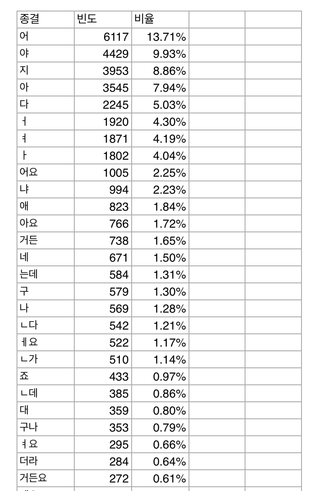

# spoken_ending_form              

21세기 세종 계획 구어 전사 말뭉치(EF로 태깅)                  
2007년 기준 172만 어절 중                   
종결어미 종류 472개 빈도 순 정렬                    

## quick peek               
                     